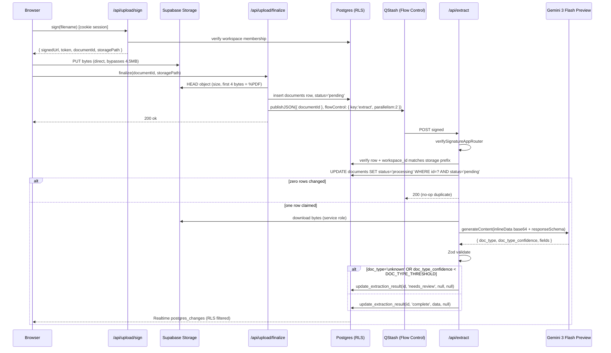

# feat: OTC Accounting SaaS Prototype

## Overview

Build a deployed, multi-tenant demo SaaS that lets an accountant drag a stack of tax PDFs into a browser, watches Gemini 3 Flash Preview extract structured data asynchronously, allows inline review/correction with AI-confidence surfacing, and exports per-doc-type CSVs as a zip. The hard evaluation deadline is **Friday 2026-04-24 15:00 EDT** — this plan covers three working days from kickoff (Tue 2026-04-21).

The plan translates a complete, unambiguous requirements document (R1–R35 in the origin) into a dependency-ordered, phase-sequenced build. External-contract drift was verified in planning research and is reflected in the key technical decisions below (Supabase `getClaims`, QStash Flow Control, Gemini `@google/genai` SDK, Gemini 3 Flash Preview as the extraction model — swapped in on Wed 2026-04-22 per reviewer direction, replacing the original Gemini 2.5 Flash choice).

## Problem Frame

OTC is in active sales conversations with accounting firms. The artifact that accelerates those conversations is a polished, deployed demo that demonstrates (a) AI extraction quality, (b) real multi-tenant isolation, (c) async processing resilience, and (d) a trustworthy review workflow — not a prototype feel.

The reviewer at the firm will open the live URL, log into two seeded accounts, drag in PDFs, watch live status streaming, correct low-confidence fields, export a zip, and — critically — try to cross the workspace boundary. Anything that feels like a prototype (broken state, poor error handling, cross-tenant leak, unpolished surfaces) kills the sales motion; the requirements document deliberately scopes this to maximize polish per day.

See origin document for full problem framing: `docs/brainstorms/otc-accounting-saas-requirements.md`.

## Requirements Trace

Requirements are numbered R1–R35 in the origin document. Every implementation unit in this plan lists the requirement IDs it advances; the **Cross-Reference Matrix** below confirms full coverage.

### Cross-Reference Matrix

| Requirement                                                                 | Primary Unit(s)               |
| --------------------------------------------------------------------------- | ----------------------------- |
| R1 Email+password auth                                                      | U5                            |
| R2 Workspace auto-create on first signup                                    | U3 (trigger)                  |
| R3 Workspace-scoped RLS                                                     | U3                            |
| R4 Two seeded demo accounts                                                 | U14                           |
| R5 Drag-and-drop multiple PDFs                                              | U10                           |
| R6 Per-file cap 10 MB, per-batch cap 10 files + magic-bytes check           | U9, U10                       |
| R7 Direct-to-Storage signed upload URLs                                     | U9, U10                       |
| R8 Finalize inserts row + enqueues QStash                                   | U9                            |
| R9 QStash Flow Control parallelism 2                                        | U8                            |
| R10 `/api/extract` signature + payload authorization                        | U8                            |
| R11 Idempotent claim + inline Gemini call + SECURITY DEFINER write          | U6, U8                        |
| R12 Failure path writes row via `update_extraction_result`                  | U8                            |
| R13 Four doc types (K-1 conditional)                                        | U6, U7                        |
| R13a Confidence UI (per-field dot, per-doc count chip, edited_fields latch) | U11 (chip), U12 (dot + latch) |
| R13b "Next uncertain" button + Alt+N                                        | U12                           |
| R14 Status machine incl. needs_review with type-picker                      | U8, U12                       |
| R14a needs_review excluded from export                                      | U13                           |
| R15 Searchable filterable table                                             | U11                           |
| R16 Search + filters                                                        | U11                           |
| R17 Realtime streaming                                                      | U11                           |
| R18 Detail view + signed preview URL                                        | U12                           |
| R19 Editable form with explicit Save + dirty guard                          | U12                           |
| R20 Hard delete row + Storage object                                        | U11                           |
| R21 Zip of per-doc-type CSVs                                                | U13                           |
| R22 Export respects filters                                                 | U13                           |
| R23 Live Vercel URL                                                         | U15                           |
| R24 GitHub repo with collaborator                                           | U1, U15                       |
| R25 README                                                                  | U15                           |
| R26 Loom walkthrough                                                        | U15                           |
| R27 Credentials emailed                                                     | U15                           |
| R28a Storage RLS mirrors DB RLS                                             | U3                            |
| R28b Realtime publication on documents                                      | U3                            |
| R28c Service-role usage inventory                                           | U4, U15 (README)              |
| R28d Write handlers authed via SSR cookie + Origin check                    | U4, U8–U13                    |
| R28e UUIDs server-generated                                                 | U3                            |
| R28f `update_extraction_result` SECURITY DEFINER hardening                  | U3                            |
| R32 Strict TS + Zod at I/O                                                  | U2, U6, all                   |
| R33 User-facing error handling                                              | U8, U10, U11, U15             |
| R34 Secrets handling                                                        | U1, U4                        |
| R35 Accepted risks + demo banner                                            | U10, U15                      |

## Scope Boundaries

This plan explicitly **does not** include:

- QuickBooks Online OAuth, Microsoft/Google OAuth sign-in
- Multi-user firms / roles UI (schema is ready; UI is not)
- PDF bounding-box annotation, Excel/CSV ingestion
- Audit log UI, transactional email, Sentry/PostHog
- Comprehensive automated test coverage (per-unit `Test scenarios` define targeted tests only; the full suite is a post-demo task)
- Rate limiting / Arcjet
- OCR pre-pass (Gemini vision handles scanned PDFs)
- Custom animations beyond shadcn defaults, custom domain
- Doc types beyond **W-2, 1099-NEC, 1099-MISC, Schedule K-1** (K-1 is itself conditional — see U7)
- Re-extraction / reclassification of `complete` docs (admin path, out of scope)
- Per-field auto-save on the edit form (explicit Save button only, per R19)
- Polling fallback for Realtime (auto-reconnect handles transients; extended outage → manual refresh, per R17)

### Deferred to Separate Tasks

- Confidence-UI extensions (dedicated review mode, low-confidence filter, low-confidence sort): future iteration
- Pagination / streaming CSV export: post-submission iteration (the 4.5 MB response-body cap is a known ceiling at ≤100 docs/workspace scale)
- Reclassification flow for `complete` docs: requires admin path, future iteration

## Context & Research

### Relevant Code and Patterns

This is a fresh Next.js 16.2.4 + React 19.2.4 + Tailwind v4 boilerplate with no Supabase, no shadcn, no Zod, no extraction, no QStash wired up. The starting surface is:

- `src/app/layout.tsx`, `src/app/page.tsx`, `src/app/globals.css`, `src/app/favicon.ico`
- `package.json`, `tsconfig.json`, `next.config.ts` (with `reactCompiler: true`), `eslint.config.mjs`
- `AGENTS.md` (Next 16 guidance: read `node_modules/next/dist/docs/` before writing any code)

There are no existing patterns to mirror — this plan establishes them. The reference docs in `node_modules/next/dist/docs/01-app/` are load-bearing for Next 16 specifics (particularly `01-getting-started/16-proxy.md`, which documents the `middleware.ts` → `proxy.ts` rename).

### Institutional Learnings

`docs/solutions/` does not exist yet in this repo. No prior institutional learnings to carry in.

### External References

Planning research surfaced seven contract-level deltas vs. typical LLM training data. The plan incorporates all of them:

1. **Next 16 proxy** — The Supabase SSR session-refresh pattern moves verbatim from `middleware.ts` to `proxy.ts` (project root or `src/`), same matcher config, same cookie `getAll`/`setAll` shape. No `@supabase/ssr` API change. Source: `node_modules/next/dist/docs/01-app/01-getting-started/16-proxy.md`; https://github.com/supabase/supabase/blob/master/examples/prompts/nextjs-supabase-auth.md
2. **`getClaims()` over `getUser()`** — For projects with asymmetric JWT signing keys (default for new Supabase projects in 2026), `supabase.auth.getClaims()` verifies tokens locally via JWKS with no network hop, falling back to `getUser()` for legacy HS256 projects. Use in `proxy.ts` and in Route Handlers where only identity is needed. Reserve `getUser()` for paths where a live auth round-trip is wanted.
3. **QStash Flow Control is primary, not fallback** — Upstash has deprecated `parallelism > 1` on named queues in favor of Flow Control. Publish with `flowControl: { key: 'extract', parallelism: 2 }` on every call; no `queue.upsert` needed. Source: https://upstash.com/docs/qstash/features/flowcontrol
4. **QStash App Router signature helper** — `verifySignatureAppRouter` from `@upstash/qstash/nextjs` wraps a standard `Request`. Requires `QSTASH_CURRENT_SIGNING_KEY` and `QSTASH_NEXT_SIGNING_KEY` (both, for key rotation). Source: https://upstash.com/docs/qstash/quickstarts/vercel-nextjs
5. **Gemini SDK is `@google/genai`** — `@google/generative-ai` is deprecated. Install `@google/genai` (latest 2026). Same API surface regardless of Gemini model generation; swap is a model-string change, not an SDK change. Source: https://www.npmjs.com/package/@google/genai
6. **Gemini 3 Flash Preview is the extraction model** — exact model ID `gemini-3-flash-preview`, released 2025-12-17, 1,048,576-token input context, 65,536-token output context, PDF inline ingestion supported, structured outputs supported. Frontier-class accuracy at low latency; priced at $0.50/M input tokens and $3.00/M output tokens on paid tier. Direction came from the evaluator on 2026-04-22. Source: https://ai.google.dev/gemini-api/docs/models/gemini-3-flash-preview; https://blog.google/products/gemini/gemini-3-flash/.
7. **Gemini schema and confidence** — `responseSchema` (OpenAPI 3.0 subset, `anyOf` supported) is sufficient for this demo; `responseJsonSchema` is available for full `oneOf`/discriminator support if `anyOf` proves insufficient during Day-1 calibration. Per-field confidence is NOT automatic — each `confidence: {type: NUMBER, minimum: 0, maximum: 1}` field and the top-level `doc_type_confidence` must be declared in the schema and prompted for explicitly. Source: https://blog.google/technology/developers/gemini-api-structured-outputs/
8. **Gemini 3 Flash Preview free-tier caps are not publicly documented.** Google surfaces live per-tier limits only inside AI Studio (https://aistudio.google.com/rate-limit). U7 fixture Day-1 pulls the actual numbers before the RPD budget in the Risks section is trusted. Until then, plan assumes conservatively that limits are no more generous than the former 2.5 Flash free tier (10 RPM / 250 RPD / 250K TPM) and applies the same parallelism=2 ceiling. If Day-1 shows tighter limits, U7 will throttle fixture runs and the plan's RPD math is revisited before U8 ships. Preview models also carry a shutdown-on-short-notice risk (Gemini 3 Pro Preview was retired 2026-03-09) — see Risks.
9. **Storage signed-upload `contentDisposition`** — `createSignedUploadUrl` does not expose `contentDisposition`. Rely on `contentType='application/pdf'` and default browser behavior to render PDFs inline in iframes (all current Chromium/Firefox/WebKit honor this). This is a minor divergence from R7's literal text — documented in README.

## Key Technical Decisions

- **Stack pinning:** Next.js 16.2.4 (App Router, proxy.ts), React 19.2.4, TypeScript strict, Tailwind v4, shadcn/ui, lucide-react, Sonner. Inherited from origin. No Drizzle / no ORM — generated Supabase types + raw queries via `@supabase/ssr`.
- **Async extraction via QStash Flow Control:** drop the "named queue with parallelism: 2 + `qstash:setup` script" path; use `flowControl: { key: 'extract', parallelism: 2 }` on every `publishJSON`. This supersedes R9 literally; the intent (throttle to ≤ Gemini free-tier) is preserved with simpler code and no setup-script maintenance burden.
- **Gemini SDK = `@google/genai`.** Model = `gemini-3-flash-preview` (swapped from `gemini-2.5-flash` on 2026-04-22 per reviewer direction). The model string is exposed via `GEMINI_MODEL` env var with a `gemini-3-flash-preview` default, so a graceful fallback to `gemini-2.5-flash` is a config change only — no redeploy code rewrite — if the preview model is retired on short notice between Fri delivery and evaluation weekend. Inline PDF bytes via `inlineData` (base64, `mimeType: 'application/pdf'`). The single extraction module `src/lib/extraction/gemini.ts` exports `extractFromPdfBytes(bytes: Uint8Array): Promise<ExtractionResult>` and is consumed by `/api/extract`, the seed script, and the fixture harness — identical prompt, schema, and Zod validation across all three.
- **Gemini schema shape:** `responseSchema` with a top-level object containing `doc_type` (enum literal), `doc_type_confidence` (0–1), and a per-type field bag where each leaf field is `{value: string | number, confidence: number}`. The `doc_type` discriminator is an enum: `'w2' | '1099_nec' | '1099_misc' | 'k1' | 'unknown'`. Zod validates Gemini's response at the I/O boundary per R32. If Day-1 testing shows `responseSchema` + `anyOf` is unreliable for the multi-type case, fall back to `responseJsonSchema` with `oneOf` — the swap is isolated to `src/lib/extraction/gemini.ts`.
- **`getClaims()` everywhere trust is server-side.** The new Supabase project is provisioned with asymmetric signing keys (default for projects created in 2026). `proxy.ts` and all authenticated Route Handlers call `supabase.auth.getClaims()`; `getUser()` is reserved for surfaces that want an explicit auth round-trip (e.g., the first load of the login page, if any).
- **Three Supabase clients, strictly partitioned:**
  - `src/lib/supabase/server.ts` — `createServerClient` (user session via cookies); used by Route Handlers and Server Components/Actions
  - `src/lib/supabase/browser.ts` — `createBrowserClient`; used by Client Components including Realtime subscribers
  - `src/lib/supabase/service.ts` — service-role `createClient`; used only in the six documented server paths (R28c) and the seed script. Never imported into shared utilities or client code.
- **Workspace auto-create on first signup** is implemented as a Postgres trigger on `auth.users` (SECURITY DEFINER, `SET search_path = ''`). This is race-free and transactional — vs. a Route Handler approach that would leave a window where a verified user has no workspace.
- **`contentDisposition='inline'`** is dropped; rely on `contentType='application/pdf'` + default iframe PDF rendering. Flagged in README. Preview URLs use `createSignedUrl(path, 60*15)` (15 min TTL per R18), minted by the single dedicated `GET /api/documents/[id]/preview-url` handler.
- **Status machine enum is a Postgres `document_status` type** defined in migration alongside the table: `pending | processing | complete | failed | needs_review` (R14). The `update_extraction_result` SECURITY DEFINER function (R28f) is the sole write path for extraction results; `/api/extract`, the seed script, and the `needs_review` save-from-UI handler all write through it.
- **CSV export buffered in memory with `jszip`.** Response is `application/zip`, filename `otc-export-YYYYMMDD-HHmm.zip`. Per-doc-type CSVs with `document_id`, `filename`, and `{field, field_confidence}` column pairs. Demo-scale headroom (≤100 docs ≈ 200 KB zip) stays well under the 4.5 MB serverless response-body cap.
- **Fixture harness is a local-only Node script** (`scripts/extract-report.ts`, invoked via `npm run extract:report`). It calls Gemini directly, compares output to `fixtures/<doc_type>/*/ground_truth.json`, writes `EXTRACTION_REPORT.md`. It is **not** CI-wired (the 250 RPD budget is finite and the report's value is in calibrating thresholds, not gating CI). README documents this.
- **Partial-batch upload error shape** (resolves an origin deferred question): `POST /api/upload/finalize` accepts one file at a time (simpler semantics, one DB insert + one QStash publish per call, easy partial success reporting); the dropzone client orchestrates the batch by calling `sign` then `finalize` per file in parallel with `Promise.allSettled`, surfacing per-file success or error via Sonner toasts. Per-file error codes: `oversize`, `non_pdf_extension`, `non_pdf_mime`, `magic_bytes_mismatch`, `storage_object_missing`, `storage_object_size_mismatch`.
- **Seed script uses the service-role client** and writes extraction results through `update_extraction_result` (same write boundary as production), per R4. Extraction runs inline (no QStash) to preserve the 500 msg/day free-tier budget.
- **ESLint rules that are non-negotiable:** `@typescript-eslint/no-explicit-any: error`, `@typescript-eslint/no-unsafe-*: error`, `@typescript-eslint/consistent-type-assertions: ['error', { assertionStyle: 'never' }]` (or equivalent ban on bare `as` casts). Origin R32 + success criterion "zero `any` or bare casts survive".
- **Naming convention:** DB column names are `snake_case` (`workspace_id`, `document_id`, `extracted_data`). TypeScript variable and property names are `camelCase` (`workspaceId`, `documentId`). At the Supabase-client boundary, generated types use the DB names; adapt on assignment (`const workspaceId = row.workspace_id`).
- **`USE_QSTASH=false` dev-bypass (resolves U8 dev-testability):** `publishExtract(documentId)` checks `process.env.USE_QSTASH`. When `'false'`, it directly imports and invokes the inner `/api/extract` handler function (factored out from the `verifySignatureAppRouter` wrapper — the wrapper is only applied to the exported `POST`). The inner function takes `{documentId}` and does all the work without signature verification. This path never runs in Vercel (`USE_QSTASH` is unset in Production/Preview; defaults to true).
- **`update_extraction_result` grant scope clarification (resolves reviewer-found bug):** The SECURITY DEFINER function is the write path for **extraction-result writes from `/api/extract` and the seed script only**. The `needs_review → complete` save from the U12 PATCH handler (user-session client) and normal edit-save on `complete` rows both use a **direct UPDATE via user-session client** — RLS enforces workspace membership, which is the correct authorization for a user saving their own doc. This keeps `update_extraction_result` grantable to `service_role` only (R28f blast-radius confinement preserved).

## Open Questions

### Resolved During Planning

- **Gemini SDK package (origin deferred Q2)** — Resolved: `@google/genai`. `@google/generative-ai` is deprecated as of 2026.
- **Gemini model generation (emergent 2026-04-22)** — Resolved via reviewer direction: switch from `gemini-2.5-flash` to `gemini-3-flash-preview`. Rationale: frontier-class accuracy for extraction; same SDK shape; swap is a one-line model-string change and happens before U6 begins, so cost is near-zero. Preview-model retirement risk is mitigated by exposing the model string as `GEMINI_MODEL` env var (see Risks table).
- **Inline `inlineData` vs File API (origin deferred Q2)** — Resolved: inline `inlineData`. Free-tier inline cap is 100 MB; demo PDFs are ≤ 10 MB; no reuse need.
- **QStash named queue vs Flow Control (supersedes R9)** — Resolved: Flow Control only. Named queue with `parallelism > 1` is deprecated upstream.
- **`getUser()` vs `getClaims()` (emergent from research)** — Resolved: `getClaims()` in proxy and Route Handlers (asymmetric keys default); `getUser()` reserved for explicit round-trip paths.
- **Partial-batch upload error object shape (origin deferred Q3)** — Resolved: one-file-per-`/api/upload/finalize` call; client uses `Promise.allSettled` to orchestrate the batch and surface per-file toasts. Error codes enumerated in the decisions above.
- **`contentDisposition='inline'` on signed upload URL (emergent from research)** — Resolved: drop; rely on default iframe PDF rendering with `contentType='application/pdf'`.
- **Workspace auto-create: trigger vs Route Handler (emergent)** — Resolved: Postgres trigger on `auth.users` insert for atomicity and race-freedom.

### Deferred to Implementation

- **Gemini 3 Flash Preview free-tier RPM/RPD/TPM** — not publicly documented. U7 Day-1 reads the live numbers from https://aistudio.google.com/rate-limit and patches the RPD budget math in the Risks table before U8 ships. Plan currently assumes the prior 2.5 Flash budget (10 RPM / 250 RPD / 250K TPM) as a conservative placeholder.
- **`responseSchema` + `anyOf` behavior on Gemini 3 Flash Preview** — structurally supported per the model docs, but Day-1 fixture calibration confirms the discriminated-union shape round-trips cleanly. Fallback to `responseJsonSchema` with `oneOf` is isolated to `src/lib/extraction/gemini.ts` if needed.
- **Exact Gemini prompt text per doc type** — Will be iterated during U7 fixture calibration. Schema is fixed in U6; prompt wording is empirical.
- **Final `CONFIDENCE_THRESHOLD` and `DOC_TYPE_THRESHOLD` values** — Origin defaults (0.85 and 0.70) are placeholders; U7 calibrates and U12 may update them if `EXTRACTION_REPORT.md` shows materially better precision/recall at a different value.
- **K-1 inclusion decision** — Gated on U7 outcome (≥ 80% accuracy after ≤ 2 schema iterations). If K-1 drops, the discriminated union in `gemini.ts`, the fixture set, the export zip entries, and the CSV column set in U14 all reduce — but only U7 (and units touching schema/export) are affected.
- **Zod schema transform for Gemini `JsonValue` vs generated Supabase `Json`** — The exact narrowing pattern for reading `extracted_data` back from `documents.extracted_data` (typed `Json`) is determined during U11/U12 implementation when the actual shape lands in a Client Component.
- **Exact `proxy.ts` matcher** — Default Supabase matcher excludes `_next/static`, `_next/image`, `favicon.ico`. Confirm no additional static asset paths need exclusion during U4.

## High-Level Technical Design

> _This illustrates the intended approach and is directional guidance for review, not implementation specification. The implementing agent should treat it as context, not code to reproduce._

### Extraction pipeline sequence



### Document state machine

```
                      ┌────────────────────────┐
                      │         pending         │
                      └───────────┬────────────┘
                                  │ claim (UPDATE ... WHERE status='pending')
                                  ▼
                      ┌────────────────────────┐
                      │       processing       │
                      └───┬────────┬───────────┘
            complete      │        │ needs_review (unknown | low doc_type conf)
       ┌──────────────────┘        └──────────────────┐
       ▼                                              ▼
  ┌──────────┐                                 ┌──────────────┐
  │ complete │                                 │ needs_review │
  └──────────┘                                 └──────┬───────┘
       ▲                                              │ user picks type + saves
       └──────────────────────────────────────────────┘
                         update_extraction_result
                         (SECURITY DEFINER, service_role only)

           any failure after QStash exhausts 3 retries:
                      processing → failed
```

### Shared extraction core

All three entry points — the QStash receiver, the local fixture harness, and the seed script — go through **one** module so prompt, schema, and validation stay in sync:

```
src/lib/extraction/gemini.ts
  ├── extractFromPdfBytes(bytes: Uint8Array): Promise<ExtractionResult>
  │     ├── build inlineData payload (base64, mimeType)
  │     ├── generateContent({ responseSchema, prompt })
  │     ├── Zod.parse(raw JSON) → ExtractionResult
  │     └── classify 'needs_review' vs 'complete' (doc_type_confidence gate)
  │
  └── consumed by:
       ├── src/app/api/extract/route.ts  (QStash-signed)
       ├── scripts/extract-report.ts     (npm run extract:report)
       └── scripts/seed-demo.ts          (npm run seed)
```

## Implementation Units

Units are grouped into phases that align with the 3-day timeline. Units within a phase can be parallelizable where their `Dependencies` allow; phases are strictly sequential.

### Phase 1 — Foundation (Tue afternoon → Wed morning)

- [x] **Unit 1: Project and environment provisioning**

**Goal:** Provision all external services and wire local/Vercel env vars so subsequent units can run.

**Requirements:** (Dependencies/Assumptions section of origin)

**Dependencies:** None (first).

**Files:**

- Create: `.env.example` (template committed)
- Create: `.env.local` (uncommitted, `.gitignore`'d — already ignored by default `.gitignore`)
- Modify: `.gitignore` (verify `.env*.local` is ignored)
- Modify: `README.md` (provisional setup section — final pass in U15)

**Approach:**

- Provision Supabase project (confirm asymmetric JWT signing keys enabled — default for new projects).
- Provision Google AI Studio API key with access to `gemini-3-flash-preview` (verify model availability at https://aistudio.google.com — preview models require the API key to be on a project that has the preview enabled). `gemini-2.5-flash` remains available as the fallback the `GEMINI_MODEL` env var can flip to.
- Provision Upstash QStash (collect `QSTASH_TOKEN`, `QSTASH_CURRENT_SIGNING_KEY`, `QSTASH_NEXT_SIGNING_KEY`).
- Provision GitHub repo (push existing boilerplate) and Vercel project linked to it.
- Commit `.env.example` with all required keys listed and commented (never real values).
- Vercel env vars configured via `vercel env add` for Production and Preview: `NEXT_PUBLIC_SUPABASE_URL`, `NEXT_PUBLIC_SUPABASE_PUBLISHABLE_KEY` (formerly anon key — both names still work, use the new name going forward), `SUPABASE_SERVICE_ROLE_KEY`, `GOOGLE_GENAI_API_KEY`, `QSTASH_TOKEN`, `QSTASH_CURRENT_SIGNING_KEY`, `QSTASH_NEXT_SIGNING_KEY`, `USE_QSTASH` (dev-only toggle; default `true` in prod).

**Patterns to follow:** None (first unit).

**Test scenarios:** Test expectation: none — this is one-time provisioning work, not code. Verification checklist below substitutes.

**Verification:**

- `vercel env ls` lists all expected keys across Production and Preview.
- A smoke request to Supabase (`curl https://<ref>.supabase.co/rest/v1/` with anon key) returns 200.
- A smoke request to Gemini (`curl` to `gemini-3-flash-preview` with a tiny prompt) returns a completion. A second curl to `gemini-2.5-flash` also succeeds, confirming the fallback is provisioned.
- `.env.local` is loaded by `next dev` without error.

---

- [x] **Unit 2: Install dependencies and initialize shadcn/ui**

**Goal:** Install all runtime and dev dependencies; initialize shadcn/ui; tighten ESLint to enforce R32.

**Requirements:** R32

**Dependencies:** U1

**Files:**

- Modify: `package.json` (add deps and scripts)
- Modify: `eslint.config.mjs` (strict TS rules, ban `any`, ban bare `as` casts)
- Create: `components.json` (shadcn config — `style: new-york`, `baseColor: neutral`, `cssVariables: true`)
- Modify: `src/app/globals.css` (shadcn CSS variables + Tailwind v4 base layer)
- Create: `src/lib/utils.ts` (shadcn `cn` helper)
- Create: `src/components/ui/*` (install: button, input, label, form, select, dialog, alert-dialog, table, dropdown-menu, badge, tooltip, skeleton, toast/sonner, card, separator, scroll-area)

**Approach:**

- Runtime deps: `@supabase/supabase-js`, `@supabase/ssr`, `@upstash/qstash`, `@google/genai`, `zod`, `jszip`, `sonner`, `lucide-react`, plus shadcn peers (`class-variance-authority`, `clsx`, `tailwind-merge`, `@radix-ui/react-*`).
- Dev deps: `@types/jszip` if needed, `tsx` (for running TS scripts), `dotenv` (for scripts).
- Run `npx shadcn@latest init` (non-interactive flags) and add the components listed above in a single command.
- Update `eslint.config.mjs` to extend `next/core-web-vitals`, `next/typescript`, and add: `no-explicit-any: error`, `no-unsafe-argument/assignment/call/member-access/return: error`, `consistent-type-assertions: ['error', { assertionStyle: 'never' }]`.
- Add `package.json` scripts (placeholders, implemented in later units): `"extract:report": "tsx scripts/extract-report.ts"`, `"seed": "tsx scripts/seed-demo.ts"`, `"db:types": "supabase gen types typescript --project-id $SUPABASE_PROJECT_REF > src/lib/database.types.ts"`.

**Patterns to follow:** shadcn's `npx shadcn@latest add` — do not hand-author components.

**Test scenarios:** Test expectation: none — scaffolding only. No behavioral change to verify.

**Verification:**

- `npm run build` completes without errors.
- `npm run lint` completes without errors on the boilerplate `page.tsx` (boilerplate is replaced in later units).
- `src/components/ui/button.tsx` exists and exports `Button`.
- Importing `Button` in `src/app/page.tsx` renders it.

---

- [x] **Unit 3: Database schema, RLS, Storage RLS, SECURITY DEFINER writer**

**Goal:** Create the `workspaces`, `workspace_members`, `documents` tables; the `document_status` enum; RLS policies; Storage bucket + Storage RLS; the `update_extraction_result` SECURITY DEFINER function; the `auth.users` → workspace trigger; and generate TypeScript types.

**Requirements:** R2, R3, R4, R17, R28a, R28b, R28e, R28f

**Dependencies:** U1

**Files:**

- Create: `supabase/config.toml` (via `supabase init`)
- Create: `supabase/migrations/20260421000001_init_schema.sql` (workspaces, workspace_members, documents, enums)
- Create: `supabase/migrations/20260421000002_rls_policies.sql` (SELECT/INSERT/UPDATE/DELETE policies on all three tables)
- Create: `supabase/migrations/20260421000003_workspace_autocreate_trigger.sql` (trigger on `auth.users` insert)
- Create: `supabase/migrations/20260421000004_storage_bucket_and_rls.sql` (bucket `documents`, storage.objects RLS)
- Create: `supabase/migrations/20260421000005_realtime_publication.sql` (ALTER PUBLICATION supabase_realtime ADD TABLE documents)
- Create: `supabase/migrations/20260421000006_update_extraction_result.sql` (SECURITY DEFINER function)
- Create: `src/lib/database.types.ts` (generated via `supabase gen types typescript`)

**Approach:**

- **Schema (migration 1):**
  - `workspaces (id uuid pk default gen_random_uuid(), name text not null, created_at timestamptz default now())`
  - `workspace_members (workspace_id uuid fk, user_id uuid fk auth.users, role text default 'owner', created_at timestamptz default now(), pk (workspace_id, user_id))`
  - `type document_status as enum ('pending','processing','complete','failed','needs_review')`
  - `documents (id uuid pk default gen_random_uuid(), workspace_id uuid fk on delete cascade, uploaded_by uuid fk auth.users, filename text not null, storage_path text not null unique, doc_type text check (doc_type in ('w2','1099_nec','1099_misc','k1','unknown') or doc_type is null), status document_status not null default 'pending', extracted_data jsonb, edited_fields jsonb, doc_type_confidence numeric, error_message text, created_at timestamptz default now(), updated_at timestamptz default now())`
  - Indexes on `documents(workspace_id)`, `documents(workspace_id, status)`, `documents(workspace_id, created_at desc)`.
- **RLS (migration 2):** Enable RLS on all three. Policies:
  - `workspaces`: SELECT where `exists (select 1 from workspace_members wm where wm.workspace_id = id and wm.user_id = auth.uid())`.
  - `workspace_members`: SELECT where `user_id = auth.uid()` OR `workspace_id` in membership set.
  - `documents`: SELECT/INSERT/UPDATE/DELETE all scoped via `exists (select 1 from workspace_members wm where wm.workspace_id = documents.workspace_id and wm.user_id = auth.uid())`. Realtime inherits the SELECT policy per CDC event (R28b).
- **Workspace-autocreate trigger (migration 3):** Function `public.handle_new_user()` runs `SECURITY DEFINER SET search_path = ''`, inserts a row into `public.workspaces` with name `<email>'s Workspace`, then inserts into `public.workspace_members (workspace_id, user_id, role)` with the new workspace id and `NEW.id`. Trigger `on_auth_user_created AFTER INSERT ON auth.users FOR EACH ROW EXECUTE FUNCTION public.handle_new_user()`.
- **Storage (migration 4):** `insert into storage.buckets (id, name, public) values ('documents', 'documents', false)`. RLS policies on `storage.objects` for bucket `documents`: SELECT/INSERT/UPDATE/DELETE allowed only when the first path segment equals a workspace_id the user is a member of. Path prefix check: `(storage.foldername(name))[1]::uuid in (select workspace_id from workspace_members where user_id = auth.uid())`.
- **Realtime (migration 5):** `ALTER PUBLICATION supabase_realtime ADD TABLE documents;` — do not configure a private channel; `postgres_changes` uses table RLS.
- **SECURITY DEFINER writer (migration 6):** `update_extraction_result(doc_id uuid, new_status document_status, data jsonb, error text)` returns void, runs `SECURITY DEFINER SET search_path = ''`, updates `public.documents` setting `status`, `extracted_data`, `error_message`, `doc_type`, `doc_type_confidence`, `updated_at`. `REVOKE ALL ON FUNCTION update_extraction_result FROM PUBLIC; GRANT EXECUTE ON FUNCTION update_extraction_result TO service_role;`.
- Push migrations to hosted Supabase: `supabase db push`. Then `npm run db:types`.

**Patterns to follow:** Supabase official CLI migrations (`supabase init`, `supabase migration new`, `supabase db push`). Keep schema and RLS in separate migrations so a reviewer can read them independently.

**Test scenarios:**

- **Happy path:** Creating a user via `supabase.auth.admin.createUser({ email_confirm: true })` results in exactly one row each in `workspaces` and `workspace_members`; the user's `workspace_id` is non-null.
- **Happy path:** Anon-key client with a signed-in user can SELECT their own workspace rows; cannot SELECT rows from a workspace they are not a member of.
- **Edge case:** Service-role client can INSERT into `documents` regardless of membership (needed by `/api/extract` write path); anon-key client cannot.
- **Edge case:** `update_extraction_result` called by service role updates the row; called with anon-key permission fails.
- **Edge case:** Storage RLS rejects a PUT under a path prefix the user is not a member of; accepts one they are.
- **Integration:** After migration apply, `ALTER PUBLICATION supabase_realtime` has `documents` listed (`select * from pg_publication_tables where pubname='supabase_realtime'`).

**Verification:**

- `supabase db push` completes without error against the hosted project.
- `npm run db:types` writes `src/lib/database.types.ts` including `Database['public']['Tables']['documents']['Row']` with the correct column types and the `document_status` union.
- Running the RLS test scenarios with two distinct users via `curl` or a scratch TS script confirms isolation in both DB and Storage.

---

- [x] **Unit 4: Supabase clients and Next 16 `proxy.ts`**

**Goal:** Create the three Supabase client factories, the Next 16 `proxy.ts` that refreshes the session via `getClaims()`, and a tiny `requireAuth()` server helper used by Route Handlers and Server Components.

**Requirements:** R1, R3, R28c, R28d

**Dependencies:** U3

**Files:**

- Create: `src/lib/supabase/server.ts` (createServerClient with Next 16 async `cookies()`)
- Create: `src/lib/supabase/browser.ts` (createBrowserClient)
- Create: `src/lib/supabase/service.ts` (plain createClient with service-role)
- Create: `src/lib/auth/require-auth.ts` (returns `{ claims, workspaceId }` or throws/redirects)
- Create: `src/lib/auth/origin-check.ts` (verifies `Sec-Fetch-Site: same-origin` + allowed origin derived from VERCEL_URL / VERCEL_PROJECT_PRODUCTION_URL / localhost)
- Create: `proxy.ts` (project root; session refresh via `getClaims()`; session-refresh logic inlined — no separate `update-session.ts` helper)

**Approach:**

- `server.ts`: async factory; reads cookies via `await cookies()` from `next/headers`; uses `getAll`/`setAll` cookie methods; swallows the setAll throw when called from a Server Component (proxy handles refresh).
- `browser.ts`: synchronous factory; singleton module-level instance is fine for the browser.
- `service.ts`: async factory that reads `SUPABASE_SERVICE_ROLE_KEY` and constructs a fresh client per-call (no module-level singleton — avoids accidental leaks into Client bundles). Throw at import time if not running server-side (`typeof window !== 'undefined'` guard).
- `proxy.ts`: exports `async function proxy(request: NextRequest)`. **Note: in proxy, cookies are read from `request.cookies.getAll()` and written to `response.cookies.set()` — NOT from `cookies()` (which is only usable in Server Components, Route Handlers, and Server Actions).** Creates a server client using these request/response cookie handlers, calls `supabase.auth.getClaims()`, returns the response with refreshed cookies. `config.matcher = ['/((?!_next/static|_next/image|favicon.ico).*)']`.
- `requireAuth()`: server-only helper that returns the current user's claims and their `workspaceId`; if unauthenticated, calls `redirect('/login')` (in Server Components) or returns `{ error: 'unauthenticated', status: 401 }` shape for Route Handlers (each handler decides behavior).
- `origin-check.ts`: called at the top of every write handler; returns boolean. Allowed origins: `http://localhost:3000` (dev), `https://${VERCEL_URL}` (preview), `https://${VERCEL_PROJECT_PRODUCTION_URL}` (prod). Require `Sec-Fetch-Site: same-origin`.

**Patterns to follow:** https://github.com/supabase/supabase/blob/master/examples/prompts/nextjs-supabase-auth.md — adapt the `middleware.ts` snippet to `proxy.ts`; use `getClaims` in place of `getUser`.

**Test scenarios:**

- **Happy path:** A request to `/` with a valid session cookie passes through proxy, arrives at the page Server Component, `requireAuth()` returns non-null claims and the user's workspaceId.
- **Error path:** A request with no session cookie to a protected page redirects to `/login`.
- **Error path:** A POST to a write handler with `Sec-Fetch-Site: cross-site` is rejected with 403.
- **Edge case:** `proxy.ts` matcher does not intercept `/_next/static/*`, `/_next/image/*`, `/favicon.ico`.
- **Integration:** Importing `service.ts` from a Client Component causes a build-time or runtime error (the guard); importing from a Route Handler succeeds.

**Verification:**

- `npm run build` passes.
- Manual: sign in, hit a protected page, confirm the session persists across a refresh (cookie roundtrip via proxy).
- `console.log` in a Client Component importing `service.ts` surfaces the import-time throw.

---

- [x] **Unit 5: Authentication pages (login, signup, verify callback)**

**Goal:** Implement the three auth surfaces so reviewers can sign in and a human new-signup can complete email verification.

**Requirements:** R1

**Dependencies:** U4

**Files:**

- Create: `src/app/(auth)/login/page.tsx` (email + password form)
- Create: `src/app/(auth)/signup/page.tsx` (email + password form; shows "check your email")
- Create: `src/app/auth/confirm/route.ts` (Supabase email confirmation callback — token exchange)
- Create: `src/app/(auth)/layout.tsx` (centered narrow shell, no dashboard chrome)
- Create: `src/app/actions/auth.ts` (Server Actions: `signIn`, `signUp`, `signOut`)
- Modify: `src/app/page.tsx` (root: if authed, redirect to `/dashboard`; else to `/login`)

**Approach:**

- Use shadcn `<Form>` with react-hook-form + Zod resolver for validation.
- `signIn` and `signUp` are Server Actions that call `supabase.auth.signInWithPassword` / `supabase.auth.signUp`. On success, `redirect('/dashboard')`. On failure, return a typed `{ error: string }` rendered inline in the form.
- Signup page shows the email-verification prompt after submission; Supabase sends the verification email automatically.
- The confirm callback handler at `/auth/confirm` exchanges the token (Supabase's `verifyOtp` flow), then redirects to `/dashboard`.
- Logout is a Server Action invoked from the dashboard top nav (implemented in U11).

**Patterns to follow:** Supabase's official Next.js email+password auth example (from the `@supabase/ssr` docs), adapted to Next 16 Server Actions.

**Test scenarios:**

- **Happy path:** Valid credentials on `/login` → `/dashboard`.
- **Error path:** Invalid credentials on `/login` → inline error; no redirect.
- **Happy path:** Valid signup → "check your email" state; email arrives; clicking link → `/dashboard` with session.
- **Edge case:** Unverified user attempting to log in → Supabase returns an error; display "please verify your email first".
- **Edge case:** Already-authenticated user hitting `/login` redirects to `/dashboard`.
- **Integration:** Signing up a new user triggers the `handle_new_user` DB trigger (U3); the resulting session has a non-null `workspaceId` reachable via `requireAuth()`.

**Verification:**

- Manual sign-up and login flows complete end to end against the hosted Supabase project.
- The DB trigger inserts exactly one `workspaces` row and one `workspace_members` row per new signup.

---

### Phase 2 — Extraction core (Wed afternoon)

- [x] **Unit 6: Shared Gemini extraction module**

**Goal:** Build `src/lib/extraction/gemini.ts` — the single entry point for PDF extraction used by `/api/extract`, the fixture harness, and the seed script.

**Requirements:** R11, R13, R14, R32

**Dependencies:** U2

**Files:**

- Create: `src/lib/extraction/gemini.ts` (`extractFromPdfBytes`, `ExtractionResult`)
- Create: `src/lib/extraction/schemas.ts` (per-doc-type Zod schemas + responseSchema literal)
- Create: `src/lib/extraction/prompt.ts` (system prompt templates)
- Create: `src/lib/extraction/types.ts` (discriminated union TS types)
- Create: `src/lib/extraction/config.ts` (`CONFIDENCE_THRESHOLD = 0.85`, `DOC_TYPE_THRESHOLD = 0.70` — named exports consumed by U7 and U12)

**Approach:**

- `types.ts` defines a TS discriminated union:
  ```
  type ExtractionResult =
    | { doc_type: 'w2'; doc_type_confidence: number; fields: W2Fields }
    | { doc_type: '1099_nec'; doc_type_confidence: number; fields: Nec1099Fields }
    | { doc_type: '1099_misc'; doc_type_confidence: number; fields: Misc1099Fields }
    | { doc_type: 'k1'; doc_type_confidence: number; fields: K1Fields }
    | { doc_type: 'unknown'; doc_type_confidence: number; fields: null }
  ```
  Each `<Type>Fields` is a record where each key is `{ value: string | number, confidence: number }`.
- `schemas.ts` declares the Gemini `responseSchema` (OpenAPI 3.0 subset) with `anyOf` across doc types, discriminated by the `doc_type` enum. The matching Zod schema validates Gemini's response at the I/O boundary.
- `prompt.ts` contains a system prompt that (a) lists the doc types, (b) describes the self-reported confidence convention (0.0–1.0, explicit per field and at doc level), (c) tells the model to return `doc_type='unknown'` when it cannot confidently classify.
- `gemini.ts` exports `extractFromPdfBytes(bytes: Uint8Array): Promise<ExtractionResult>`:
  1. base64-encode bytes, build `{inlineData: {data, mimeType: 'application/pdf'}}` content.
  2. Call `ai.models.generateContent({ model: process.env.GEMINI_MODEL ?? 'gemini-3-flash-preview', contents, config: { responseMimeType: 'application/json', responseSchema } })`.
  3. Zod-parse the `.text` response; throw a typed `ExtractionError` on validation failure.
  4. If `result.doc_type === 'unknown'` or `result.doc_type_confidence < DOC_TYPE_THRESHOLD`, callers treat the result as `needs_review` — gating logic lives in the caller, not this module (keeps the module pure).

**Patterns to follow:** `@google/genai` documented `generateContent` shape (https://www.npmjs.com/package/@google/genai).

**Execution note:** Test-first for the Zod parsing layer. Write fixture-JSON → Zod.parse tests for both valid and malformed Gemini responses before implementing `extractFromPdfBytes`. Structured output parsing is the single highest-risk code path in the whole plan.

**Test scenarios:**

- **Happy path:** Given a synthetic Gemini JSON for each of W-2, 1099-NEC, 1099-MISC, K-1, `Zod.parse` returns a valid discriminated union member with all fields and confidences.
- **Error path:** Given malformed JSON (missing `doc_type`), Zod throws; caller can distinguish from a network error.
- **Error path:** Given JSON with `doc_type='k1'` but missing required K-1 fields, Zod throws.
- **Edge case:** `doc_type='unknown'` returns a valid `ExtractionResult` with `fields: null`.
- **Edge case:** Numeric fields expressed as strings in Gemini's output (model sometimes returns "$12,345.67") — Zod coerces to number after stripping `$`and`,`.
- **Integration:** `extractFromPdfBytes(fs.readFileSync('fixtures/w2/sample1.pdf'))` returns a parsed result (live Gemini call; counts 1 RPD — run sparingly).

**Verification:**

- `npm run build` passes.
- A single live call against one W-2 fixture returns a non-null result.
- All unit tests in the Test scenarios pass.

---

- [ ] **Unit 7: Fixture harness and extraction-accuracy report**

**Goal:** Commit 2–3 IRS sample PDFs per doc type plus hand-keyed `ground_truth.json`; implement `npm run extract:report` that measures accuracy and writes `EXTRACTION_REPORT.md`. Decide K-1 inclusion based on the report.

**Requirements:** Success Criteria (≥ 90% accuracy; K-1 conditional per R13)

**Dependencies:** U6

**Files:**

- Create: `fixtures/w2/sample{1,2}.pdf` (plus `ground_truth.json` per sample — 2 per type keeps the RPD budget sane)
- Create: `fixtures/1099_nec/sample{1,2}.pdf` + ground truths
- Create: `fixtures/1099_misc/sample{1,2}.pdf` + ground truths
- Create: `fixtures/k1/sample{1,2}.pdf` + ground truths
- Create: `scripts/extract-report.ts` (driver; comparison helpers inlined — no separate lib module)
- Create: `EXTRACTION_REPORT.md` (generated; committed at submission)
- Modify: `package.json` scripts (if not yet added in U2)

**Approach:**

- Source fixture PDFs only from IRS public sample sets — no real taxpayer PII (per R35).
- `extract-report.ts`: iterates `fixtures/<doc_type>/*.pdf`, calls `extractFromPdfBytes`, loads `ground_truth.json`, compares (exact for strings, ±$0.01 for numbers, case-insensitive for names/addresses — inlined in the driver), writes per-doc-type accuracy and a threshold sweep (0.70 / 0.80 / 0.85 / 0.90) showing precision/recall of "confidence < threshold predicts at-least-one-field-error".
- Output sections: per-doc-type summary, per-field accuracy, threshold sweep, the final recommended `CONFIDENCE_THRESHOLD` and `DOC_TYPE_THRESHOLD` defaults (may differ from origin defaults).
- **RPD budget:** 8 fixtures × 1 call each = 8 RPD per full report run. A typical Day-1 involves ~6 full runs (tighten prompt, tighten schema, re-measure) = 48 RPD. Combined with dev testing (~40 RPD), seed re-runs (~8 RPD × 2 accounts × 2 re-runs = 32 RPD), and Loom recording (~12 RPD + re-record buffer = 24 RPD), total ≈ 144 RPD. Assumes the conservative placeholder cap (250 RPD) carried over from the 2.5 Flash baseline — Gemini 3 Flash Preview's published free-tier numbers are not available at plan-time, so U7 Step 1 pulls them from AI Studio (https://aistudio.google.com/rate-limit) and re-validates this budget before the harness runs its second iteration. If the live cap is below ~150 RPD, fixture runs drop to 3 iterations (24 RPD), dev-test extracts switch to cached fixture output, and Loom re-record buffer shrinks from 2x to 1.5x.
- **K-1 decision gate:** If K-1 avg accuracy after up to 2 schema iterations (prompt or field-shape tweak in `src/lib/extraction/schemas.ts`) stays below 80%, drop K-1 from the discriminated union, remove K-1 fixtures from the harness, and propagate the drop through U14 (CSV export). Record the decision at the top of `EXTRACTION_REPORT.md`.

**Patterns to follow:** None (new).

**Execution note:** Characterize the ground truth before writing the harness — hand-key the fixtures carefully; spot-checks against the hand-keyed data during test runs catch both fixture errors and extraction regressions.

**Test scenarios:**

- **Happy path:** `npm run extract:report` produces `EXTRACTION_REPORT.md` with per-doc-type accuracy ≥ 90% for W-2, 1099-NEC, 1099-MISC.
- **Happy path or K-1 drop:** K-1 accuracy is either ≥ 80% (inclusion) or < 80% (drop decision recorded in the report).
- **Edge case:** Numeric fields with different formatting ($12,345 vs 12345.00) compare as equal via ±$0.01 tolerance.
- **Edge case:** Case-insensitive name comparison (`JOHN DOE` == `John Doe`).
- **Integration:** Threshold sweep rows line up with actual `CONFIDENCE_THRESHOLD` default — defaults are updated in `src/lib/extraction/config.ts` if the report shows a better value.

**Verification:**

- `EXTRACTION_REPORT.md` is generated; W-2 / 1099-NEC / 1099-MISC all ≥ 90%.
- K-1 inclusion/drop decision is explicit and recorded.
- Defaults in `src/lib/extraction/config.ts` reflect the report's recommendation.

---

- [ ] **Unit 8: `/api/extract` QStash receiver**

**Goal:** Implement the QStash-invoked receiver: verify signature, authorize payload, perform the idempotent claim, run Gemini, write via `update_extraction_result`, handle errors.

**Requirements:** R9, R10, R11, R12, R14, R28c, R28f, R33

**Dependencies:** U3, U4, U6

**Files:**

- Create: `src/app/api/extract/route.ts` (exports `POST = verifySignatureAppRouter(handleExtract)` and exports `handleExtract` directly for the dev-bypass path)
- Create: `src/lib/qstash.ts` (exports `publishExtract(documentId: string)` — used by U9)
- Create: `scripts/extract-one.ts` (dev-only scratch script: inserts a test `documents` row + calls `handleExtract` directly — used to exercise U8 before U9 lands)

**Approach:**

- `handleExtract(request)` is the inner function: verifies QStash signature is NOT re-done here (the wrapper does it for the exported `POST`); `handleExtract` accepts a `Request` with a JSON body `{documentId}` and trusts its caller (the wrapper in prod; a direct call in dev or the scratch script).
- `POST = verifySignatureAppRouter(handleExtract)` — wraps only the exported Route Handler endpoint. The wrapper verifies signatures using `QSTASH_CURRENT_SIGNING_KEY` and `QSTASH_NEXT_SIGNING_KEY`, then passes a replayable request to `handleExtract` (so `await request.json()` inside the handler still works).
- Body = `{ documentId: string }` (Zod-validated; UUID).
- **Authorization:** load the `documents` row via service-role client. Confirm (a) row exists, (b) `workspace_id` is a UUID, (c) the Storage path it references equals `<workspace_id>/<documentId>.pdf` (R10).
- **Idempotent claim:** `update documents set status='processing' where id = $1 and status = 'pending' returning status`. If zero rows updated, return 200 (treat as duplicate / already-past-pending).
- On successful claim: fetch bytes from Storage via service role → pass to `extractFromPdfBytes` → determine final status (`complete` vs `needs_review`) per `DOC_TYPE_THRESHOLD` gate in `config.ts` → call `update_extraction_result(docId, finalStatus, data, null)`.
- On error (Gemini throws, Zod throws, Storage download fails, network): `update_extraction_result(docId, 'failed', null, message)`. Rethrow so QStash sees a 5xx and retries — retries are meant to catch the transient 429s before the row is finalized as failed. After 3 retries, QStash gives up; the row stays `failed` from the last retry's write.
- `publishExtract(documentId)` exported for U9:
  - If `process.env.USE_QSTASH === 'false'`: dynamically `import('@/app/api/extract/route')` → `handleExtract(new Request('http://localhost/api/extract', { method: 'POST', body: JSON.stringify({documentId}) }))`. No signature, no network hop. Runs only in local dev.
  - Else (default, including all Vercel deployments): `qstashClient.publishJSON({ url: ABSOLUTE_URL + '/api/extract', body: { documentId }, flowControl: { key: 'extract', parallelism: 2 }, retries: 3 })`. `ABSOLUTE_URL` derived at runtime from `VERCEL_URL` / `VERCEL_PROJECT_PRODUCTION_URL` / `NEXT_PUBLIC_BASE_URL`.
- **U8 integration test path (since U9's upload API does not exist yet):** `scripts/extract-one.ts` accepts `--pdf <path> --doc-type <type>`, uses the service-role client to upload a PDF to a seeded workspace's storage path + insert a `documents` row with `status='pending'`, then calls `handleExtract` directly. This exercises the full U8 pipeline (auth checks, claim, Gemini, write) before U9 lands. The script is kept post-U9 for debugging.

**Patterns to follow:** `verifySignatureAppRouter` wrapping (`@upstash/qstash/nextjs`).

**Execution note:** Write an integration test first for the idempotent claim — the single most important correctness property in the pipeline. Simulate duplicate delivery by invoking the handler twice for the same `documentId` and confirm exactly one Gemini call happens.

**Test scenarios:**

- **Happy path:** Valid signed request with a `pending` row → Gemini called once → row transitions to `complete` with extracted data.
- **Happy path:** Valid signed request where Gemini returns `doc_type='unknown'` → row transitions to `needs_review`.
- **Happy path:** Valid signed request where `doc_type_confidence < DOC_TYPE_THRESHOLD` → row transitions to `needs_review`.
- **Edge case (idempotency):** Two requests for the same `documentId` arriving simultaneously → one successful claim, one no-op; exactly one Gemini call made; exactly one successful final write.
- **Edge case:** Valid signed request but row is already `complete` → no Gemini call; handler returns 200.
- **Edge case:** Valid signed request but row is already `failed` → no Gemini call; handler returns 200 (terminal no-op).
- **Error path:** Invalid QStash signature → 401.
- **Error path:** Signature valid but `documentId` points at a row whose `workspace_id` doesn't match its Storage path → 403 before any Gemini call.
- **Error path:** Gemini throws (429 or 5xx) → row stays `processing`, handler returns 5xx so QStash retries; after 3 retries row is written `failed` with `error_message`.
- **Error path:** Zod fails to parse Gemini output → row transitions to `failed` with `error_message`.
- **Integration:** End-to-end from `publishExtract(docId)` → QStash → handler → row reaches `complete`; verify via Postgres SELECT.

**Verification:**

- Unit tests for signature, authorization, idempotent claim, and status transitions all pass.
- One end-to-end integration (a real QStash publish against a deployed Preview URL) lands the row at `complete`.

---

### Phase 3 — Upload pipeline (Thu morning)

- [ ] **Unit 9: Upload API endpoints**

**Goal:** Implement `/api/upload/sign` (mint signed upload URL + allocate `document_id`) and `/api/upload/finalize` (verify object, insert row, enqueue QStash).

**Requirements:** R5, R6, R7, R8, R28c, R28d, R28e

**Dependencies:** U3, U4, U8

**Files:**

- Create: `src/app/api/upload/sign/route.ts` (POST)
- Create: `src/app/api/upload/finalize/route.ts` (POST)
- Create: `src/lib/upload/validate.ts` (shared size and magic-bytes validation)

**Approach:**

- **`/sign` (POST):**
  - `requireAuth()` → workspaceId.
  - Origin check (`origin-check.ts`).
  - Zod-parse body: `{ filename: string }`.
  - Server-side checks: filename length ≤ 255, no path separators, extension == `.pdf`.
  - Generate `documentId = crypto.randomUUID()`; construct `storagePath = '${workspaceId}/${documentId}.pdf'`.
  - Call `supabase.storage.from('documents').createSignedUploadUrl(storagePath, { upsert: false })` (via service role so the row doesn't exist yet and user-scoped Storage RLS wouldn't apply to the "write documents row" step — but Storage RLS still enforces the prefix by policy on the mint).
  - Return `{ signedUrl, token, documentId, storagePath }`.
- **`/finalize` (POST):**
  - `requireAuth()` → workspaceId + userId.
  - Origin check.
  - Zod-parse body: `{ documentId: string (uuid), filename: string, storagePath: string }`.
  - Verify `storagePath` starts with the user's `workspaceId` (defense in depth — the signed upload URL already enforces it).
  - Download first 4 bytes + HEAD for size: `supabase.storage.from('documents').download(storagePath, { transform: { width: 0 } })` or `.info(storagePath)` — use whichever surfaces size and the first bytes cheaply. First 4 bytes must equal `%PDF` (`0x25 0x50 0x44 0x46`); size must be ≤ 10 MB. On mismatch: delete the Storage object, return `{ ok: false, code: 'magic_bytes_mismatch' | 'oversize' | 'storage_object_missing' }` with 400.
  - Insert `documents` row: `{ id: documentId, workspace_id: workspaceId, uploaded_by: userId, filename, storage_path: storagePath, status: 'pending' }`.
  - `await publishExtract(documentId)` (U8).
  - Return `{ ok: true, documentId }`.

**Patterns to follow:** `createSignedUploadUrl` + `uploadToSignedUrl` pattern from Supabase docs.

**Execution note:** Implement `/finalize` with an integration test first — the magic-bytes + size verification is the security boundary for the upload path; a false negative means a non-PDF enters the pipeline.

**Test scenarios:**

- **Happy path:** POST `/sign` returns a 200 with `{signedUrl, token, documentId, storagePath}`; the storage path has the caller's workspaceId prefix.
- **Happy path:** After PUT to Storage and POST `/finalize`, a `documents` row exists in status `pending` and a QStash message is in flight.
- **Edge case:** `/sign` rejects filenames with path separators (`../` or `/`).
- **Edge case:** `/sign` rejects non-`.pdf` extensions with 400.
- **Error path:** `/finalize` rejects an object whose first bytes are not `%PDF` (code `magic_bytes_mismatch`); no row is inserted; the object is deleted.
- **Error path:** `/finalize` rejects an object > 10 MB (code `oversize`); no row is inserted.
- **Error path:** `/finalize` rejects a storagePath whose workspace prefix differs from the caller's workspace (code `forbidden_path`).
- **Integration:** End-to-end from the dropzone UI (U10) — a valid PDF reaches `pending` + QStash publish; an invalid PDF surfaces a per-file toast.

**Verification:**

- All test scenarios pass.
- A hand-crafted upload via `curl` (mint → PUT → finalize) lands a row in `pending` and triggers the QStash run.

---

- [ ] **Unit 10: Upload dropzone UI**

**Goal:** Build the drag-and-drop upload surface with client-side validation, batch orchestration via `Promise.allSettled`, and per-file success/error toasts. Include the demo-only banner (R35).

**Requirements:** R5, R6, R33, R35

**Dependencies:** U9

**Files:**

- Create: `src/app/(app)/upload/page.tsx` (Server Component shell)
- Create: `src/app/(app)/upload/UploadDropzone.tsx` (Client Component)
- Create: `src/app/(app)/layout.tsx` (authed app layout — top nav with sign-out button + demo banner)
- Create: `src/components/DemoBanner.tsx` (the R35 persistent banner)

**Approach:**

- `UploadDropzone` uses a controlled native `<input type='file' multiple accept='application/pdf'>` inside an HTML5 drop zone (per-file `drop` handler). Do NOT pull in `react-dropzone` — native DOM handling is enough.
- Client-side validation before making any network calls: extension == `.pdf`, `File.type === 'application/pdf'`, `File.size ≤ 10 * 1024 * 1024`, total batch ≤ 10 files. Per-file errors surface as a Sonner toast with the filename.
- For valid files: `Promise.allSettled(files.map(uploadOne))` where `uploadOne`:
  1. POST `/api/upload/sign` → `{signedUrl, token, documentId, storagePath}`.
  2. `supabase.storage.from('documents').uploadToSignedUrl(storagePath, token, file, { contentType: 'application/pdf', upsert: false })` (via browser client).
  3. POST `/api/upload/finalize` with `{documentId, filename: file.name, storagePath}`.
  4. Success toast: "Queued: filename.pdf". Failure toast with error code.
- Progress UI: per-file row with filename, progress bar (0–33% sign, 33–66% upload, 66–100% finalize), final state icon (check or x).
- `DemoBanner`: persistent, shadcn `Alert` variant, yellow, copy per R35 ("Demo only: synthetic PDFs..."). Rendered in `(app)/layout.tsx` so every authed surface shows it.
- After a successful batch, button "View dashboard" or auto-navigate after 3s.

**Patterns to follow:** shadcn `Alert`, `Button`, Sonner toasts.

**Test scenarios:**

- **Happy path:** Drop 3 valid PDFs → all three land in `pending` on the dashboard after Realtime confirms.
- **Edge case:** Drop a batch of 11 files → the 11th file is rejected client-side with a toast ("Max 10 per batch"); 10 files proceed.
- **Edge case:** Drop a 12 MB PDF → rejected client-side with a toast; no network call.
- **Edge case:** Drop a `.txt` file → rejected client-side with a toast.
- **Error path:** Network failure between `/sign` and PUT → that file shows a failure toast; sibling files in the batch proceed.
- **Error path:** PUT succeeds but `/finalize` returns `magic_bytes_mismatch` (e.g., a non-PDF renamed to `.pdf`) → failure toast; no row; the orphan Storage object is deleted by `/finalize`.
- **Integration:** Demo banner is rendered on `/upload`, `/dashboard`, `/documents/[id]` (once U11, U12 land).

**Verification:**

- Manual batch upload of 10 mixed-validity PDFs surfaces expected toasts; dashboard reflects the valid subset.
- Demo banner is present on every authed page.

---

### Phase 4 — Review UI (Thu afternoon)

- [ ] **Unit 11: Dashboard (list, search, filters, Realtime, delete)**

**Goal:** The workspace dashboard — table of documents with search, doc-type and status filters, Realtime status streaming, low-confidence count chip, row-level delete, inline failed-row error indicator.

**Requirements:** R15, R16, R17, R20, R33

**Dependencies:** U10

**Files:**

- Create: `src/app/(app)/dashboard/page.tsx` (Server Component: initial data fetch)
- Create: `src/app/(app)/dashboard/DashboardTable.tsx` (Client Component: table + Realtime + filters + search)
- Create: `src/app/(app)/dashboard/DeleteDocumentButton.tsx` (Client Component with AlertDialog)
- Create: `src/app/api/documents/[id]/route.ts` (DELETE handler: hard-delete row + Storage object)

**Approach:**

- Server Component loads initial list (`documents` rows for workspace, ordered by `created_at DESC`). Passes it as a prop to the Client Component.
- `DashboardTable` subscribes to Realtime `postgres_changes` on `documents` (filter: `workspace_id=eq.${workspaceId}`) via the browser Supabase client. RLS enforces scoping on the server per CDC event (R17, R28b); the client-side filter is optimization, not the security boundary.
- **Mount ordering (resolves race):** on mount, (1) open the Realtime subscription and start buffering events; (2) fetch the current list via the browser Supabase client (a second source of truth in addition to the Server Component's pre-fetched prop — keeps client and CDC in sync from the same clock); (3) merge the buffered events into the fetched list, de-duplicating by id and taking the newer `updated_at` when both carry the same id. This prevents rows inserted between the Server Component query and the subscription starting from being missed.
- Handle three event types: `INSERT` (prepend row if id unseen), `UPDATE` (merge by id), `DELETE` (remove by id — DELETE payload only carries the PK under default REPLICA IDENTITY, which is sufficient).
- On `UPDATE` where new status is `failed`, fire a one-time Sonner toast for that document (R33).
- Search: debounced client-side filter matching `filename` + any `payer` / `employer` / `tin` extracted-data string values (case-insensitive substring). Server-side re-query would be cleaner but adds latency; for a ≤ 100-doc workspace, client-side filter is O(n) and fine.
- Filters: shadcn `Select` for `doc_type` (All, W-2, 1099-NEC, 1099-MISC, K-1) and `status` (All, pending, processing, complete, needs_review, failed). Selected filters are URL params (`?status=needs_review&type=w2`) so the export handler can consume them.
- Low-confidence count chip: for `complete` rows, render `<Badge>N to review</Badge>` in a fixed-width column between status and date, where N = count of fields with `confidence < CONFIDENCE_THRESHOLD` AND not yet edited (per the `edited_fields` map). Absent when N=0.
- Failed-row inline indicator: red error icon in the status cell; click → shadcn `Popover` with `error_message`.
- Delete: shadcn `AlertDialog` with destructive-variant confirm button ("Delete document"), destructive colors. On confirm, POST `DELETE /api/documents/[id]`.
- `DELETE /api/documents/[id]`: `requireAuth` + origin check + workspace membership → load row → delete Storage object via service role → delete row (CASCADE OK). Return 204. Hard delete per R20.

**Patterns to follow:** Supabase Realtime subscription snippet from the official docs. shadcn `Table`, `Select`, `AlertDialog`, `Badge`, `Popover`.

**Test scenarios:**

- **Happy path:** Uploading a PDF in another tab → the dashboard receives an `INSERT` event and the row appears without a refresh.
- **Happy path:** `/api/extract` updates a row to `complete` → the row's status chip updates in real time and the count chip reflects low-confidence fields.
- **Happy path:** Filtering by `status=needs_review` → only `needs_review` rows are rendered.
- **Happy path:** Searching for a substring of a payer's name in a `complete` row → only matching rows are rendered.
- **Edge case:** Realtime WebSocket drops and auto-reconnects → prior state persists; new events after reconnect are processed without duplicates.
- **Edge case:** A DELETE event arrives for a row not in local state → no-op (no crash).
- **Edge case:** Clicking "Delete" on a row → confirmation dialog; cancel → nothing happens. Confirm → row removed from UI; `documents` row gone in DB; Storage object gone in bucket.
- **Error path:** `/api/documents/[id]` DELETE returns 500 → row stays in local state; error toast.
- **Error path:** A row transitions to `failed` → one Sonner toast fires; the row's inline error indicator is clickable.
- **Integration (cross-workspace):** Log into two seeded workspaces in two browsers — Realtime events from workspace A are not received in workspace B. (Validates R3 + R28b.)

**Verification:**

- Manual: upload, watch the status chain animate `pending → processing → complete` in real time.
- Side-by-side two-workspace test shows zero cross-workspace events or rows.
- Delete test: storage object is gone from the bucket after the action.

---

- [ ] **Unit 12: Detail view (PDF preview, edit form, confidence UI, needs_review, Next-uncertain)**

**Goal:** The document detail page — side-by-side PDF preview and editable form, with per-field confidence dots, the "Next uncertain" button, the `needs_review` type-picker banner, explicit Save with unsaved-changes guard, and signed-preview-URL expiry handling.

**Requirements:** R13a, R13b, R14, R18, R19

**Dependencies:** U11

**Files:**

- Create: `src/app/(app)/documents/[id]/page.tsx` (Server Component: data fetch + workspace auth)
- Create: `src/app/(app)/documents/[id]/DocumentDetail.tsx` (Client Component shell)
- Create: `src/app/(app)/documents/[id]/PdfPreview.tsx` (iframe wrapper + expired-preview prompt)
- Create: `src/app/(app)/documents/[id]/ExtractedFieldsForm.tsx` (per-doc-type editable form)
- Create: `src/app/(app)/documents/[id]/NeedsReviewPicker.tsx` (doc-type dropdown for `needs_review`)
- Create: `src/app/(app)/documents/[id]/ConfidenceBadge.tsx` (low-confidence dot + tooltip)
- Create: `src/app/(app)/documents/[id]/NextUncertainButton.tsx` (with Alt+N keyboard shortcut)
- Create: `src/app/api/documents/[id]/preview-url/route.ts` (GET: mint 15-min signed URL)
- Create: `src/app/api/documents/[id]/route.ts` (PATCH: save extracted_data + edited_fields; also handles the `needs_review → complete` type-picker save)
- Create: `src/app/(app)/documents/[id]/form-schemas.ts` (per-doc-type form Zod schemas — separate from the Gemini extraction schemas; these describe the _edited_ shape)

**Approach:**

- Server Component: `requireAuth` → fetch row → if not found or workspace mismatch, 404; render `DocumentDetail` with the row.
- `GET /api/documents/[id]/preview-url`: `requireAuth` + membership check → `supabase.storage.from('documents').createSignedUrl(storagePath, 60*15)`. Sole endpoint allowed to mint read signed URLs (R28c).
- `PdfPreview`: renders `<iframe src={signedUrl} />` with height:100%. Tracks URL expiry via a timer (14 min); at expiry, shows an inline prompt ("Preview expired — click to reload") that re-fetches via `/preview-url`.
- `ExtractedFieldsForm`:
  - If `status === 'needs_review'`, render `NeedsReviewPicker` instead. When the user picks a type and saves, PATCH submits `{ doc_type, extracted_data: emptyShapeFor(doc_type) }`; server writes via `update_extraction_result(id, 'complete', data, null)` after re-verifying workspace and Zod-validating `doc_type`.
  - If `status === 'complete'`: render the per-doc-type form. `doc_type` is **read-only** (R14).
  - For each field, render an input prefixed with `ConfidenceBadge` when `confidence < CONFIDENCE_THRESHOLD` AND `edited_fields[fieldName] !== true`. First edit to the field flips `edited_fields[fieldName] = true`; the badge is removed immediately (one-way latch, per R13a — reverting to original value does not restore the badge).
  - Dirty-state tracker (react-hook-form's `isDirty`). On navigation attempt with dirty state: shadcn `AlertDialog` confirms discard or cancel.
  - Save button (primary, sticky footer). On save, PATCH `/api/documents/[id]` with `{extracted_data, edited_fields}`. Optimistic update; on server 4xx/5xx, revert and toast.
- `NextUncertainButton`: iterates visible form fields in DOM order, finds the next field where `confidence < threshold AND !edited_fields[name]`, scrolls + focuses it. Wraps from last to first. Bound to Alt+N globally on the page. Button is hidden when no uncertain fields remain.
- `PATCH /api/documents/[id]`:
  - `requireAuth` + origin check + membership.
  - Zod-parse body against the per-doc-type form schema (strict).
  - For `needs_review → complete` path: direct `UPDATE documents SET status='complete', doc_type=$2, extracted_data=$3, updated_at=now() WHERE id=$1` via the **user-session** Supabase client. RLS enforces workspace membership (the user can only update rows in a workspace they are a member of). Does NOT go through `update_extraction_result` — that function is `GRANT EXECUTE TO service_role` only, which the user-session client does not have.
  - For edit-save on a `complete` row: direct `UPDATE documents SET extracted_data=$2, edited_fields=$3, updated_at=now() WHERE id=$1` via the user-session client. Same RLS authorization.
  - Rationale: `update_extraction_result` (R28f) is reserved for extraction-result writes from `/api/extract` and the seed script (both of which use service-role). User-saved writes are authorized by RLS on a user-session client, so they do not need — and should not have — access to the SECURITY DEFINER function.

**Patterns to follow:** shadcn `AlertDialog`, `Tooltip`, `Badge`, `Input`, `Select`. react-hook-form + Zod resolver for per-doc-type forms.

**Execution note:** Characterization-first on `ConfidenceBadge` and `NextUncertainButton` — these are the subtle UX primitives that carry the demo's trust story (R13a/b). Write DOM-level assertions before implementation so the one-way latch and wrap-around are pinned.

**Test scenarios:**

- **Happy path:** Open a `complete` W-2 — side-by-side preview + editable form; fields with low confidence have dots; edit any low-confidence field → dot disappears; press Save → row updates in DB and dashboard reflects new count.
- **Happy path:** On a `needs_review` row, pick "W-2" from the dropdown → empty W-2 form renders; fill and save → status = `complete`, doc_type = `w2` on the dashboard.
- **Edge case:** Change the picker dropdown mid-edit (non-empty form) → confirm dialog; discard → form re-renders for the new type with empty fields.
- **Edge case:** Navigate away from a dirty form → `AlertDialog` appears; cancel → stays on page; discard → navigation proceeds.
- **Edge case:** Edit a low-confidence field, then revert the value → badge stays gone (one-way latch per R13a).
- **Edge case:** Alt+N with no uncertain fields → no-op (button is hidden, shortcut listener returns early).
- **Edge case:** Alt+N from the last uncertain field → wraps to the first uncertain field.
- **Error path:** Signed preview URL expires mid-view → inline prompt; clicking it fetches a new URL; iframe reloads.
- **Error path:** Save returns 500 → optimistic change reverts; error toast.
- **Integration:** Saving flips `edited_fields[fieldName]=true` in DB; returning to the detail view later shows no badge on the edited fields.
- **Integration (read-only doc_type on complete):** On a `complete` row, the doc_type UI element is disabled and cannot be changed.

**Verification:**

- Manual walkthrough of a W-2, a 1099, and a K-1 (if included) end-to-end from `complete` → edit → save.
- Manual walkthrough of a `needs_review` doc through the type-picker to `complete`.
- Alt+N keyboard shortcut cycles through uncertain fields.

---

### Phase 5 — Export (Fri morning)

- [ ] **Unit 13: CSV zip export**

**Goal:** `GET /api/export` returns an `application/zip` with per-doc-type CSVs, respecting current dashboard filters. Includes a client-side export button on the dashboard that surfaces filter state.

**Requirements:** R21, R22, R14a

**Dependencies:** U11

**Files:**

- Create: `src/app/api/export/route.ts` (GET)
- Create: `src/lib/export/csv.ts` (per-doc-type column definitions + CSV serialization)
- Modify: `src/app/(app)/dashboard/DashboardTable.tsx` (add Export button)

**Approach:**

- Export button in dashboard reads current filters from URL params; builds `GET /api/export?status=...&type=...` (URL params, same shape as dashboard). Button is disabled when the filtered set is empty (client-computed); tooltip "No documents to export".
- Handler: `requireAuth` → fetch documents matching filters AND `status='complete'` only (R14a excludes needs_review; R22 excludes pending/processing/failed) → group by `doc_type` → build one CSV per doc_type present → zip via `jszip` → return `Response` with `content-type: application/zip` and `content-disposition: attachment; filename="otc-export-YYYYMMDD-HHmm.zip"`.
- If no rows match after filters: return `400 { error: 'no_documents_match' }`.
- CSV columns per doc type (value columns + sibling `*_confidence` columns):
  - `w2.csv`: `document_id,filename,employer_name,employer_ein,employee_name,employee_ssn,wages_tips,federal_tax_withheld,social_security_wages,medicare_wages, ...` each with a `<field>_confidence` sibling.
  - Similar narrow column lists for `1099_nec.csv`, `1099_misc.csv`, `k1.csv` (K-1 only if included per U7 outcome).
- CSV escaping: standard RFC 4180 — wrap any field containing `,`, `"`, `\n`, or `\r` in double quotes, double-escape internal double quotes.

**Patterns to follow:** `jszip` standard usage (one `zip.file(name, content)` call per CSV; `zip.generateAsync({type:'nodebuffer'})` to produce the body).

**Test scenarios:**

- **Happy path:** Export with no filters → zip contains `w2.csv` + `1099_nec.csv` + `1099_misc.csv` (+ `k1.csv` if K-1 included), each populated with the complete rows.
- **Happy path:** Filter by `type=w2`, export → zip contains only `w2.csv`.
- **Happy path:** Filter by `status=complete`, export → excludes pending/processing/failed/needs_review regardless of other filters.
- **Edge case:** Exporting with `status=needs_review` set → 400 (after the filter is applied to the server side, no `complete` rows match).
- **Edge case:** Filtered set is empty → the client-side button is disabled; calling the endpoint directly returns 400.
- **Edge case:** Extracted-data field containing commas or newlines → correctly quoted in CSV; opens cleanly in Excel and Google Sheets.
- **Integration:** Exported CSVs opened in Excel and Google Sheets show recognizable column names and values (manual test before submission — part of the Success Criteria gate).

**Verification:**

- Unit tests for filter combinations and CSV escaping.
- Manual Excel + Google Sheets open of the exported zip from a seeded account.

---

### Phase 6 — Ship (Fri early afternoon)

- [ ] **Unit 14: Seed script with two demo accounts**

**Goal:** `npm run seed` creates two pre-verified demo accounts (populated + empty), uploads fixture PDFs to the populated account, and extracts them inline (bypassing QStash). Ensures the reviewer can log into either without clicking a verification email.

**Requirements:** R4, R27

**Dependencies:** U3, U6 (inline extraction), U9 (Storage paths + `update_extraction_result` write boundary)

**Files:**

- Create: `scripts/seed-demo.ts`
- Create: `scripts/lib/demo-users.ts` (hardcoded credentials for the two demo accounts — emailed separately to reviewer per R27)

**Approach:**

- Script is idempotent: checks if each demo user exists; if so, deletes their workspace's documents and storage objects, then re-seeds. (Full user deletion is avoided because workspace-trigger re-creation on each run adds complexity; simpler to keep the users and reset their workspace's docs.)
- Creates users via `supabase.auth.admin.createUser({ email_confirm: true })` — pre-verified, R4.
- For the populated account: iterates 3–6 fixture PDFs, uploads each to Storage under `<workspace_id>/<document_id>.pdf` via service role, inserts a `documents` row, calls `extractFromPdfBytes` inline, writes the result via `update_extraction_result` (same write boundary as production, R4).
- For the empty account: just creates the user; workspace autocreated via DB trigger.
- Logs both accounts' emails and passwords at the end for copy/paste into the reviewer email.

**Patterns to follow:** Supabase admin API (`auth.admin.createUser`).

**Test scenarios:**

- **Happy path:** `npm run seed` populates the first account with N documents all in `complete` status; the second account is empty.
- **Happy path:** Re-running `npm run seed` (idempotent) produces the same end state; no duplicate rows.
- **Edge case:** If Gemini fails on one fixture during seeding, that fixture's row is written with `status='failed'` and the script continues.
- **Integration (critical):** Logging into account 1 in one browser window and account 2 in another — account 2 sees zero documents, account 1 sees its full set. (Validates R3 workspace isolation.)

**Verification:**

- Manual login to both accounts confirms populated vs empty state.
- Two-browser side-by-side test passes workspace isolation.

---

- [ ] **Unit 15: Error-handling polish, deploy, README, Loom**

**Goal:** Final error-handling polish, demo banner confirmation, Vercel deploy to production URL, GitHub repo push with `alex@owntheclimb.com` invited, README covering setup + architecture + what's-not-built, 3–5 min Loom walkthrough, EXTRACTION_REPORT.md committed.

**Requirements:** R23, R24, R25, R26, R27, R33, R35

**Dependencies:** All prior units (13 is the last feature unit)

**Files:**

- Modify: `README.md` (final content: setup, architecture with service-role inventory per R28c, what was built, what was intentionally not built, known issues, demo banner rationale, extract-report doc)
- Create: `docs/loom-script.md` (beat list per R26: problem framing, happy path with Realtime, confidence-UI trust moment, two-account isolation test, reference to EXTRACTION_REPORT.md)
- Modify: `EXTRACTION_REPORT.md` (final commit — re-generated against the final schema and fixture set)

**Approach (time-boxed — Fri 13:00 → 15:00 EDT, 2 hours total):**

| Time        | Task                                                                                                                                                                                                                                                                                                                                                                                                                                                                                                                                   |
| ----------- | -------------------------------------------------------------------------------------------------------------------------------------------------------------------------------------------------------------------------------------------------------------------------------------------------------------------------------------------------------------------------------------------------------------------------------------------------------------------------------------------------------------------------------------- |
| 13:00–13:20 | Audit pass: `grep -rn ' as ' src/` and `grep -rn ': any' src/` return zero hits (R32 success criterion). `npm run build` clean. `npm run lint` clean. Demo banner visible on all authed pages.                                                                                                                                                                                                                                                                                                                                         |
| 13:20–13:40 | Error-handling polish: final toast copy, inline failed-row popover, preview-URL expiry prompt sanity-check.                                                                                                                                                                                                                                                                                                                                                                                                                            |
| 13:40–14:00 | Final `npm run extract:report` run against the final schema; commit `EXTRACTION_REPORT.md`.                                                                                                                                                                                                                                                                                                                                                                                                                                            |
| 14:00–14:15 | `vercel --prod` deploy; smoke test the production URL from an incognito window. Invite `alex@owntheclimb.com` to the GitHub repo.                                                                                                                                                                                                                                                                                                                                                                                                      |
| 14:15–14:25 | README final pass: "Setup" (env vars, `supabase db push`, `npm run seed`, `npm run dev`), "Architecture" (HLD diagram from this plan, three Supabase clients, service-role inventory per R28c), "What was built" (bullet list of R's satisfied), "What was intentionally not built" (Scope Boundaries from this plan), "Known issues" (R35 accepted risks + 4.5 MB export ceiling + iOS Safari iframe PDF + QStash global Flow Control key + no migration rollback), "Extraction quality" (summary stats from `EXTRACTION_REPORT.md`). |
| 14:25–14:35 | Write `docs/loom-script.md` beat list (timing, narration, which demo fixtures).                                                                                                                                                                                                                                                                                                                                                                                                                                                        |
| 14:35–14:55 | Record Loom against the populated demo account. One take; re-record only for catastrophic fumbles. Target 4 minutes.                                                                                                                                                                                                                                                                                                                                                                                                                   |
| 14:55–15:00 | Email `alex@owntheclimb.com` with: prod URL, repo URL, Loom link, both demo credentials, Supabase URL + publishable + service-role keys, Gemini API key, QStash keys (R27).                                                                                                                                                                                                                                                                                                                                                            |

- If any time bucket overruns, the fallback cut in Risks applies: skip the `EXTRACTION_REPORT.md` re-run (commit the last successful one), trim the Loom script to 3 minutes, and defer any non-critical error-handling polish.

**Test scenarios:**

- Test expectation: none for code — this is final polish + deploy. Verification checklist below substitutes.

**Verification (Success Criteria check):**

- Reviewer can log into each test account, see only that workspace's data.
- Dragging multiple PDFs streams `pending → processing → complete | needs_review | failed` via Realtime.
- A `needs_review` doc can be picked, saved, and flips to `complete`.
- `EXTRACTION_REPORT.md` is committed; W-2/1099-NEC/1099-MISC all ≥ 90%; K-1 status recorded.
- Under-15-second correction on W-2 / 1099 and under-45-second on K-1 is feasible.
- CSV export opens cleanly in Excel and Google Sheets.
- Deploy is live; repo is pushed with `alex@owntheclimb.com` invited; Loom posted at ≤ 5 min.
- Zero `any` / bare casts in the codebase.

---

## System-Wide Impact

- **Interaction graph:**
  - DB trigger on `auth.users` (U3) runs on every signup, regardless of source (web signup, admin API, seed script). Consequence: seed and test flows implicitly exercise workspace autocreate. Any change to the trigger's signature must keep the seed path working.
  - Realtime CDC on `documents` (U3) fires on every write — including writes through `update_extraction_result`. The dashboard (U11) assumes RLS-scoped events only; cross-workspace leakage would be catastrophic.
  - The single extraction module (U6) is consumed by three code paths (`/api/extract`, `scripts/extract-report.ts`, `scripts/seed-demo.ts`). A schema or prompt change ripples to all three simultaneously — this is intentional.
  - The `update_extraction_result` SECURITY DEFINER function (U3) is the single write path for extraction results from `/api/extract`, the seed script, and the `needs_review` save action. Any schema migration to `documents` must update this function.
- **Error propagation:**
  - `/api/extract` → Gemini error → row `failed` + `error_message`. UI path: Realtime UPDATE fires → Sonner toast in dashboard (U11) → inline error icon on row → click → popover with `error_message`.
  - `/api/upload/finalize` → magic-bytes mismatch → delete Storage orphan + return 400 → dropzone toast. No row created; no QStash publish.
  - Server-side error in a Server Action on login → inline form error; no redirect.
- **State lifecycle risks:**
  - Partial-write risk on upload: successful `PUT` to Storage followed by a failure in `/finalize`. Mitigation: `/finalize` deletes the Storage object on any validation failure; orphan Storage objects from network-dropped `finalize` calls are acceptable (not exposed in UI, cleaned up manually post-demo if needed).
  - Duplicate delivery from QStash: mitigated by the idempotent `WHERE status='pending'` claim (U8).
  - Delete race: deleting a row while `/api/extract` is processing it. Mitigation: the claim is atomic via `UPDATE ... WHERE status='pending'`; a concurrent DELETE either happens first (handler sees zero rows → no-op) or happens during processing (handler's final write fails because the id is gone → caught, no user impact; Storage object already deleted).
- **API surface parity:**
  - Both `/api/upload/finalize` and `/api/extract` enforce the workspace-path-prefix invariant (R10) — a change to the Storage path shape needs a coordinated update to both handlers and U3's Storage RLS policy.
  - Both `/api/documents/[id]` PATCH and the `/api/extract` write go through `update_extraction_result` for extraction results, but PATCH uses a direct `UPDATE` for pure edits (which is RLS-safe because it's a user-session client). Keeping these write paths distinct preserves the R28f blast-radius guarantee.
- **Integration coverage:**
  - Two-workspace side-by-side Realtime test (U11 scenarios) is the most important integration test in the plan — it validates R3 + R17 + R28b together.
  - Idempotent-delivery test for `/api/extract` (U8 scenarios) is the second — it validates R11 under concurrent/duplicate delivery.
  - End-to-end upload → extract → dashboard → edit → export flow is the third — it validates every write boundary in one pass and is the Loom demo path.
- **Unchanged invariants:**
  - Service-role client is never imported in Client Components, Server Components that render HTML, or shared utilities (R28c) — enforced by import guard in U4 and documented in README.
  - All `documents` table writes go through either (a) the user-session client (RLS enforced), (b) `update_extraction_result` SECURITY DEFINER (R28f-hardened), or (c) the seed script (local, one-time).
  - All `documents` table reads in Client Components go through the browser Supabase client with the authenticated session — no direct `fetch` to PostgREST with raw anon key.
  - Workspace IDs and document IDs are always server-generated via `gen_random_uuid()` (R28e) — never user-supplied.

## Risks & Dependencies

| Risk                                                                                             | Likelihood | Impact                                           | Mitigation                                                                                                                                                                                                                                                                                                                                                                                                                                                                                                                                                                                                                                                              |
| ------------------------------------------------------------------------------------------------ | ---------- | ------------------------------------------------ | ----------------------------------------------------------------------------------------------------------------------------------------------------------------------------------------------------------------------------------------------------------------------------------------------------------------------------------------------------------------------------------------------------------------------------------------------------------------------------------------------------------------------------------------------------------------------------------------------------------------------------------------------------------------------- |
| Gemini 3 Flash Preview free-tier limits unknown at plan-time                                     | Medium     | High (blocks Day-1 fixture calibration)          | Plan assumes the conservative 2.5-era cap (10 RPM / 250 RPD / 250K TPM) until U7 Day-1 reads the live numbers from AI Studio. Fixture set sized to 8 fixtures (2 per doc type); harness local-only; dev testing uses `USE_QSTASH=false` + single-PDF loop; seed runs inline. Per-day assumed-RPD budget: ~6 report runs × 8 fixtures (48) + ~40 dev extracts + ~16 seed re-runs (8 docs × 2 accounts) + ~24 Loom/recording ≈ **~128 RPD steady-state**, 122 RPD headroom under the assumed 250 cap. If Day-1 shows tighter limits (e.g., 100 RPD), fixture harness runs drop to 3/day and dev-test extracts switch to fixture-cache reuse until the budget is re-sized. |
| Gemini 3 Flash Preview retired on short notice (as Gemini 3 Pro Preview was on 2026-03-09)       | Low        | High if between Fri ship and eval weekend        | `GEMINI_MODEL` env var defaults to `gemini-3-flash-preview`; the same API key provisions access to `gemini-2.5-flash` as a fallback. Flipping models is a Vercel env-var change + redeploy — no code change, no schema change. README documents the fallback command. Worst-case degrades the demo to 2.5-era accuracy without taking the deployment down.                                                                                                                                                                                                                                                                                                              |
| K-1 accuracy < 80% after 2 schema iterations                                                     | Medium     | Medium (narrows the demo)                        | R13 codifies the drop path: K-1 exits the discriminated union, fixtures, zip entries, and CSV schema. Drop is mechanical and tracked in U7's gate.                                                                                                                                                                                                                                                                                                                                                                                                                                                                                                                      |
| Supabase Realtime dropping events during demo                                                    | Low        | High (loses the "live updates" story)            | Auto-reconnect handles transients; README documents manual refresh for extended outages. Demo Loom is recorded against the live system so the happy path is captured on tape.                                                                                                                                                                                                                                                                                                                                                                                                                                                                                           |
| Service-role client accidentally leaks into a Client bundle                                      | Low        | Catastrophic (cross-workspace data leakage)      | `src/lib/supabase/service.ts` throws at module import if `typeof window !== 'undefined'`. ESLint rule `no-restricted-imports` added in U2 blocks `@/lib/supabase/service` from Client Components. README documents the pattern. Adversarial code review at U15 audits every import.                                                                                                                                                                                                                                                                                                                                                                                     |
| Gemini `responseSchema` returns malformed JSON                                                   | Medium     | Medium                                           | Zod validates at the boundary (U6); malformed response transitions the row to `failed` with `error_message` and retries via QStash (3 attempts).                                                                                                                                                                                                                                                                                                                                                                                                                                                                                                                        |
| QStash Flow Control `key: 'extract'` is a global (per-QStash-account) ceiling, not per-workspace | Low        | Low for demo                                     | Parallelism 2 globally is fine for the two-account demo (10 PDFs × 20s / 2 = ~100s). Documented in README as a known production ceiling.                                                                                                                                                                                                                                                                                                                                                                                                                                                                                                                                |
| iOS Safari blocks `application/pdf` in iframes regardless of Content-Disposition                 | Low        | Low for demo (reviewer uses desktop)             | Documented in README known issues; demo is recorded on desktop browsers.                                                                                                                                                                                                                                                                                                                                                                                                                                                                                                                                                                                                |
| Fixture PDFs contain real PII                                                                    | Very Low   | Very High (R35 violation; training data leakage) | Fixtures sourced only from IRS public sample sets; spot-check during U7. README banner R35 is load-bearing.                                                                                                                                                                                                                                                                                                                                                                                                                                                                                                                                                             |
| Next 16 + `@supabase/ssr` edge case in proxy.ts                                                  | Low        | Medium                                           | Pattern is identical to Next 15 middleware.ts; Supabase's official prompt already targets Next 16 (research citation). Manual smoke test immediately after U4.                                                                                                                                                                                                                                                                                                                                                                                                                                                                                                          |
| Time overrun past the Fri 15:00 EDT deadline                                                     | Medium     | Critical                                         | Phased delivery with explicit day-boundaries. If Phase 4 (Thu afternoon) slips, drop K-1 (already conditional), drop free-text search in U11 (reduces to filename-only filter), defer CSV column `*_confidence` siblings in U13. Order of cuts documented here.                                                                                                                                                                                                                                                                                                                                                                                                         |

## Phased Delivery

### Phase 1 — Foundation (Tue afternoon → Wed morning)

- U1 (provisioning), U2 (deps + shadcn), U3 (schema + RLS + triggers + SECURITY DEFINER), U4 (Supabase clients + proxy.ts), U5 (auth pages)
- **Exit criterion:** A signed-up user lands on a placeholder `/dashboard` via the proxy session flow; two-account isolation is testable at the DB level via raw RLS queries.

### Phase 2 — Extraction core (Wed afternoon)

- U6 (Gemini module), U7 (fixture harness + K-1 decision), U8 (`/api/extract` receiver)
- **Exit criterion:** `EXTRACTION_REPORT.md` shows W-2/1099-NEC/1099-MISC ≥ 90%; K-1 inclusion decided; end-to-end `publishExtract → QStash → handler → update_extraction_result` proven on a dev fixture.

### Phase 3 — Upload pipeline (Thu morning)

- U9 (upload API), U10 (dropzone UI)
- **Exit criterion:** Dragging a valid PDF onto the dropzone streams `pending → processing → complete` without manual intervention.

### Phase 4 — Review UI (Thu afternoon)

- U11 (dashboard), U12 (detail view)
- **Exit criterion:** Two-browser two-workspace test shows zero cross-workspace events; confidence UI + Next-uncertain work; needs_review round-trip works.

### Phase 5 — Export and Seed (Fri morning, parallelizable)

- U13 (CSV zip) and U14 (seed script) — U14's dependencies (U3, U6, U9) are all satisfied by end of Phase 4, so the two units can run concurrently Fri morning.
- **Exit criterion:** Export from a seeded account opens cleanly in Excel and Google Sheets; both demo accounts log in and show the expected populated vs empty state; the two-browser isolation test passes on the live Preview URL.

### Phase 6 — Ship (Fri early afternoon, before 15:00 EDT)

- U15 (error polish + README + deploy + Loom + reviewer email) — time-boxed internally (see U15 Approach)
- **Exit criterion:** All R23–R27 deliverables complete; reviewer email sent.

## Documentation Plan

- **README.md** — the only reviewer-facing doc. Must cover setup, architecture (with diagrams from this plan's HLD section), service-role inventory (R28c), what was / wasn't built, known issues (R35 accepted risks + export ceiling), and extraction quality summary.
- **EXTRACTION_REPORT.md** — committed at submission (R13a rationale record).
- **docs/loom-script.md** — internal artifact; not part of the reviewer email.
- **`.env.example`** — list of required keys with comments.
- **Inline code comments** — only at the SECURITY DEFINER function, the three Supabase clients, and the QStash receiver's idempotent claim. These are the non-obvious security boundaries and merit a one-line WHY.

## Operational / Rollout Notes

- **Not applicable for a prototype demo.** No staging environment, no feature flags, no monitoring. Vercel deploys on push to main. Supabase migrations applied via `supabase db push` during U3 against the hosted dev project.
- **Migration rollback:** None of the six migrations ships with a down-migration. This is deliberate for a disposable demo — if a migration has a bug, fix-forward with a new migration. Documented in README known issues.
- **Rollback plan:** None. The demo project is disposable; if a critical bug ships, revert the latest commit and re-deploy.

## Sources & References

- **Origin document:** [docs/brainstorms/otc-accounting-saas-requirements.md](../brainstorms/otc-accounting-saas-requirements.md)
- **Next.js 16 proxy docs (in-repo):** `node_modules/next/dist/docs/01-app/01-getting-started/16-proxy.md`
- **Supabase Next.js auth prompt (Next 16-ready):** https://github.com/supabase/supabase/blob/master/examples/prompts/nextjs-supabase-auth.md
- **Supabase Realtime + RLS:** https://supabase.com/docs/guides/realtime/authorization
- **Supabase Storage signed uploads:** https://supabase.com/docs/guides/storage/uploads/resumable-uploads
- **Upstash QStash Flow Control:** https://upstash.com/docs/qstash/features/flowcontrol
- **Upstash QStash Next.js Quickstart:** https://upstash.com/docs/qstash/quickstarts/vercel-nextjs
- **Google GenAI SDK:** https://www.npmjs.com/package/@google/genai
- **Gemini structured outputs (JSON Schema announcement):** https://blog.google/technology/developers/gemini-api-structured-outputs/
- **Gemini 3 Flash Preview model doc:** https://ai.google.dev/gemini-api/docs/models/gemini-3-flash-preview
- **Gemini 3 Flash announcement (2025-12-17):** https://blog.google/products/gemini/gemini-3-flash/
- **Gemini rate limits (public page; live numbers only in AI Studio):** https://ai.google.dev/gemini-api/docs/rate-limits — live per-tier view at https://aistudio.google.com/rate-limit
- **Gemini document understanding (inline PDF):** https://ai.google.dev/gemini-api/docs/document-processing
